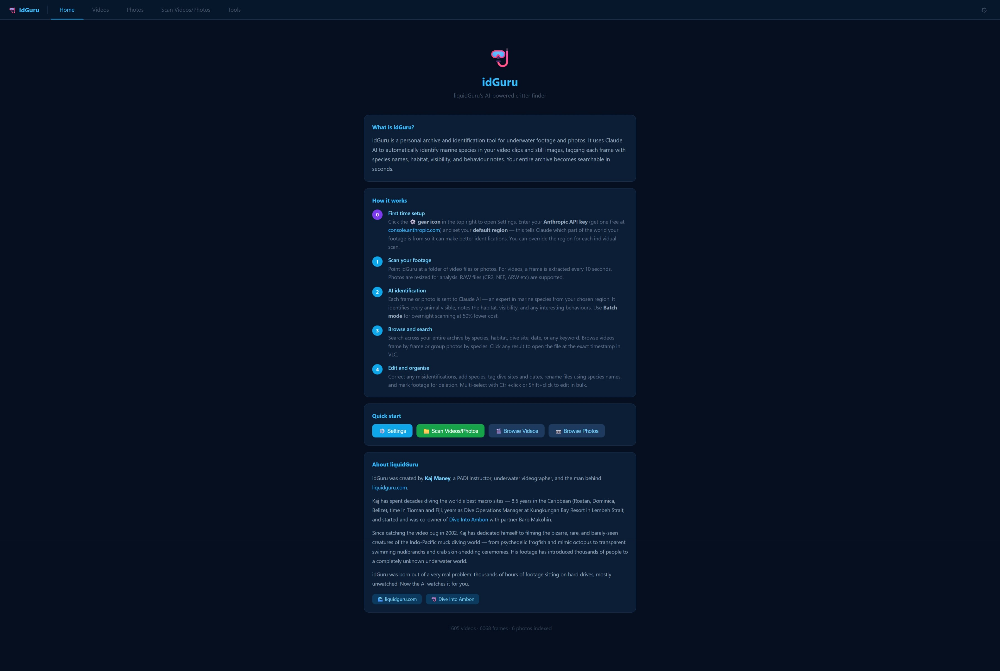
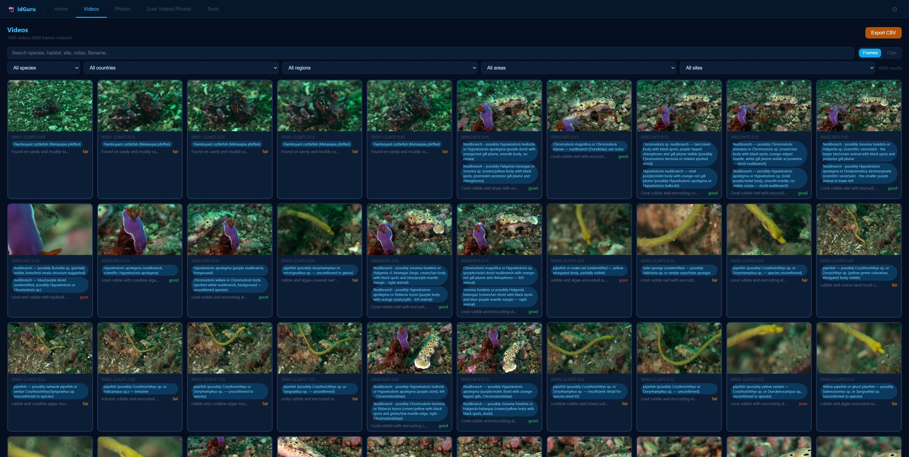
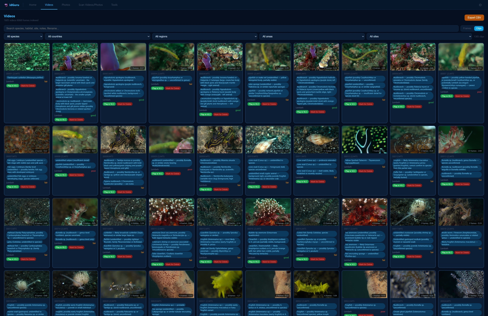
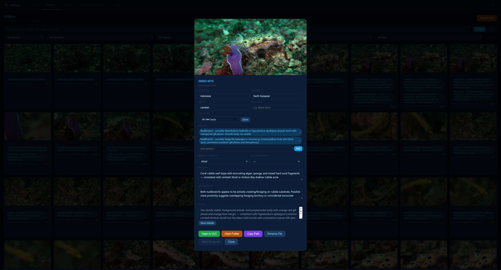
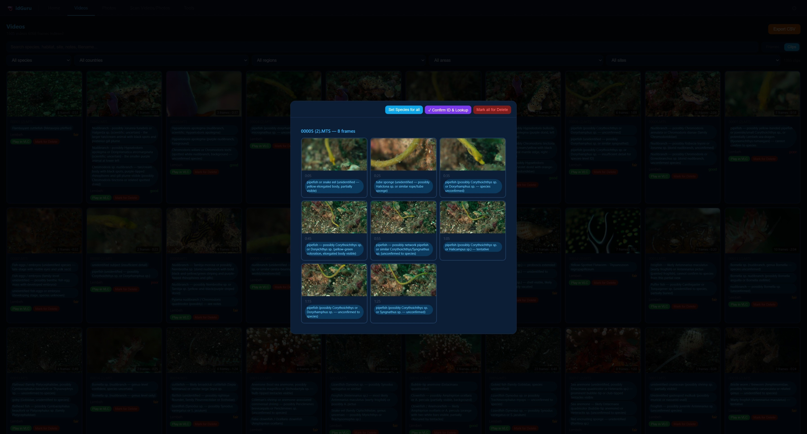
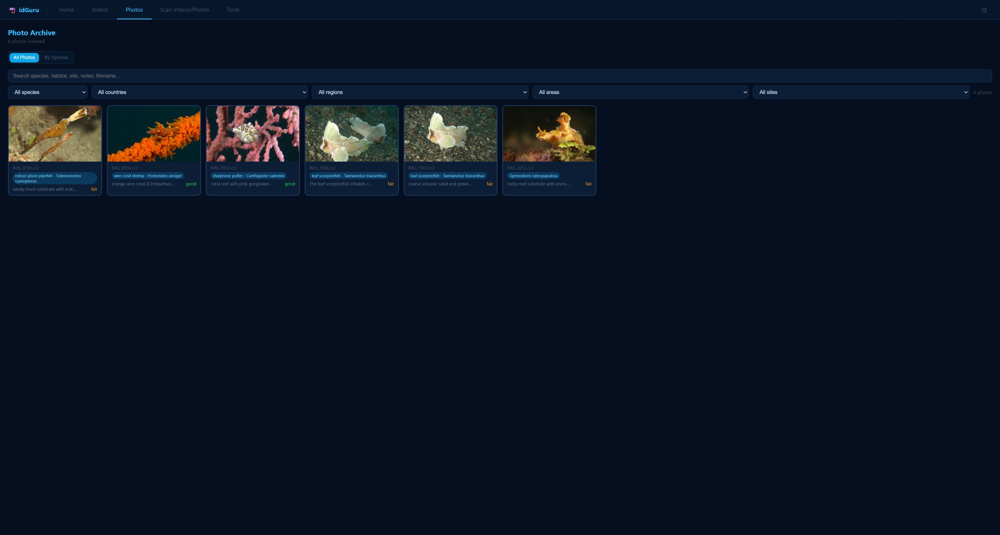
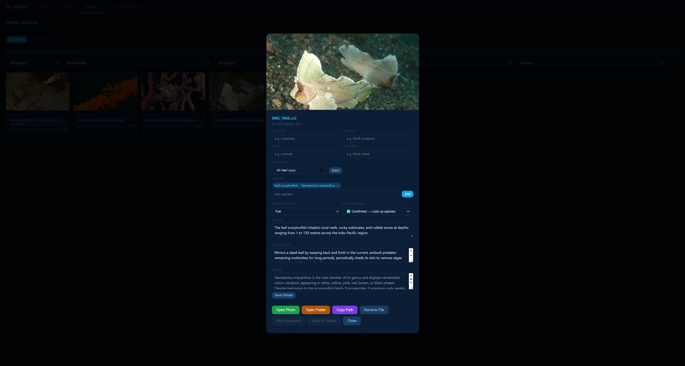
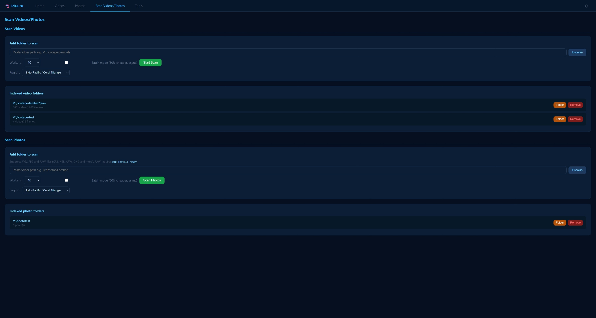
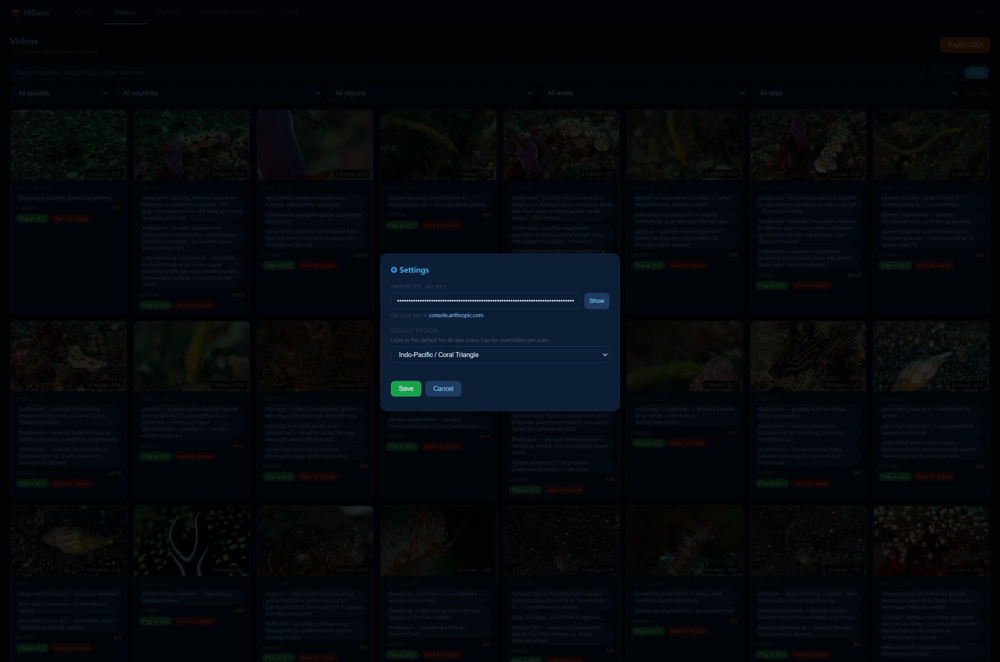

# idGuru — AI-Powered Underwater Species Identifier

> Built by [liquidGuru](https://www.liquidguru.com) · Powered by [Claude AI](https://anthropic.com)

idGuru uses Claude AI to automatically identify marine species in your underwater video footage and still photos, building a fully searchable archive of everything you've shot. You can also manually identify, correct, or confirm any species — and once identified, batch rename your actual video and photo files on disk using the species name. Complete control over your media catalogue.

**[⬇️ Download latest release](https://github.com/liquidguru/idguru/releases/latest)** · **[📸 See screenshots](#screenshots)**

---

## Requirements

- **Python 3.11 or 3.12** (recommended) — https://www.python.org/downloads/  
  Python 3.13 and 3.14 are not yet supported due to missing pre-built wheels for pydantic-core
- **ffmpeg** (for video indexing) — installed via winget (see below)
- **An Anthropic API key** — https://console.anthropic.com
- **VLC** (optional, for opening video at timestamps) — https://www.videolan.org/

---

## Installation

## Windows — One-Click Installer (No setup required)

The easiest way to get started on Windows. No Python, no ffmpeg, no dependencies — just download and run.

**[⬇️ Download idGuru.exe](https://github.com/liquidguru/idguru/releases/latest)**

1. Download `idGuru.exe` from the latest release
2. Double-click to run — Windows may show a security warning, click **More info → Run anyway**
3. idGuru opens in your browser automatically at `http://localhost:5001`
4. A small **idGuru icon appears in your system tray** (bottom right) — right-click to **Open** or **Quit**
5. Click the **⚙️ gear icon** in the browser to enter your Anthropic API key

> **Note:** The exe is self-contained and includes ffmpeg. Your index is stored in `C:\Users\<you>\.underwater_index\` and is preserved between sessions.

---

## Windows — Manual Installation (Python)


**1. Install Python**
- Go to https://www.python.org/downloads/
- Download the **Windows installer (64-bit)** for Python **3.12** — this is the standalone installer, not the Microsoft Store version
- Run the installer and tick **"Add Python to PATH"** before clicking Install
- Verify: open PowerShell and type `python --version`

**2. Install ffmpeg**
- Open PowerShell and run:
  ```
  winget install ffmpeg
  ```
- Close and reopen PowerShell, then verify: `ffmpeg -version`
- If winget isn't available, download ffmpeg from https://www.gyan.dev/ffmpeg/builds/ — grab the **ffmpeg-release-full.zip**, extract it, and add the `bin` folder to your PATH

**3. Install idGuru dependencies**
- Download the latest release zip and extract it to a folder
- Double-click **`setup.bat`**

**4. Launch**
- Double-click **`launcher.pyw`**

---

### macOS

**1. Install Python**
- Go to https://www.python.org/downloads/ and download the **macOS installer** for Python **3.12**
- Or via Homebrew: `brew install python@3.12`
- Verify: open Terminal and type `python3 --version`

**2. Install ffmpeg**
- Via Homebrew (recommended): `brew install ffmpeg`
- Verify: `ffmpeg -version`

**3. Install idGuru dependencies**
- Download the latest release zip and extract it
- Open Terminal, navigate to the folder and run:
  ```
  chmod +x setup.sh
  ./setup.sh
  ```

**4. Launch**
- Run `python3 launcher.pyw` or double-click it in Finder

---

## First Run

1. Launch idGuru — it opens in your browser at `http://localhost:5000`
2. Click the **⚙️ gear icon** (top right) to open Settings
3. Enter your **Anthropic API key** (get one at [console.anthropic.com](https://console.anthropic.com)) and set your **default region**
4. Click **Save**

---

## Scanning footage

### Videos
1. Go to **Scan Videos/Photos** tab
2. Under **Scan Videos**, paste or browse to your footage folder
3. Choose your region (overrides the default for this scan)
4. Choose workers (10 is good for most machines)
5. Click **Start Scan**

For large collections, tick **Batch mode** — it costs 50% less and runs asynchronously overnight. Results appear when the batch completes.

### Photos
Same process under the **Scan Photos** section. Supports JPG/JPEG, TIFF, and RAW files (CR2, NEF, ARW, DNG, ORF, RAF, RW2, PEF, SRW).

For RAW files, install rawpy: `pip install rawpy`

---

## Browsing & Editing

- **Videos tab** — browse all indexed frames, filter by species/country/region/area/site
- **Photos tab** — browse photos, switch to **By Species** to see grouped results
- Click any card to open the detail modal — edit species, habitat, behaviours, notes, add location/date, rename files
- **Ctrl+click** or **Shift+click** to select multiple items for bulk editing
- Set **ID Confidence** to **Confirmed** to trigger an automatic species information lookup

### Confirming IDs & looking up species info
When you've identified a species (either correcting Claude or confirming its guess):
- **Single item** — open the detail modal, set **ID Confidence** to **✅ Confirmed**, and the habitat, behaviours and notes will be automatically filled in
- **Multiple selected items** — use the **✓ Confirm ID & Lookup** button in the selection bar
- **Whole clip** — open the clip, use the **✓ Confirm ID & Lookup** button in the clip header

A checkbox picker lets you choose which species to confirm when multiple are tagged.

---

## Regions supported

| Region | Notes |
|--------|-------|
| Indo-Pacific / Coral Triangle | Lembeh, Ambon, Raja Ampat, Philippines |
| Caribbean | Bonaire, Cayman, Roatan, Cozumel |
| Red Sea | Dahab, Sharm, Brothers Islands |
| UK / North Europe | Scotland, Norway, Farne Islands |
| West Coast USA | California kelp forests, Oregon, Washington |
| East Coast USA | North Carolina, Florida, New England |
| Australia / New Zealand | GBR, Coral Sea, Poor Knights |
| Mediterranean | Malta, Croatia, Greece |
| Japan | Izu, Okinawa, Hokkaido |

Each region gives Claude context about local species to improve identification accuracy.

---

## Cost

idGuru uses the Anthropic API — you pay for what you use. Approximate costs:

| Mode | Cost per frame/photo |
|------|---------------------|
| Standard | ~$0.002–0.004 |
| Batch mode | ~$0.001–0.002 |

A 1-hour video at 1 frame/10s = ~360 frames ≈ $0.70–$1.40 standard, $0.35–$0.70 batch.

---

## Data storage

Your index is stored locally at:
- **Windows:** `C:\Users\<you>\.underwater_index\`
- **macOS/Linux:** `~/.underwater_index/`

This contains the SQLite database and thumbnail cache. Your original files are never modified unless you use the Rename or Delete features.

---

## Troubleshooting

**"No API key" / nothing gets indexed**
- Open Settings (⚙️) and enter your Anthropic API key from [console.anthropic.com](https://console.anthropic.com)

**`SystemError: pydantic-core version incompatible`**
- You are likely running Python 3.13 or 3.14 — these are not yet supported
- Switch to Python 3.12: install it from https://www.python.org/downloads/ then run `py -3.12 setup.bat` (Windows) or `python3.12 setup.sh` (macOS)
- Or pin pydantic manually: `pip install "pydantic>=2.10.0,<2.13.0" "pydantic-core>=2.41.0,<2.42.0"`

**"rawpy not installed" when scanning RAW files**
- Run: `pip install rawpy`

**ffmpeg not found / video scan errors**
- Run `winget install ffmpeg` in PowerShell (Windows), or `brew install ffmpeg` (macOS)
- Close and reopen your terminal after installing, then try again

**VLC not opening at timestamp**
- Make sure VLC is installed at the default location

**Blank cmd window appears on Windows**
- Use `launcher.pyw` not `launcher.py` — the `.pyw` extension suppresses the console window

**Photos not scanning when using a mapped network drive (e.g. V:\)**
- Use the full UNC path instead: `\\servername\share\folder`
- Or update to v1.2.3 which resolves mapped drive letters automatically

---

## Screenshots


*The idGuru home screen — overview, how it works, and quick start buttons*


*Browse thousands of indexed video frames, filtered by species, location, site and more*


*Clips view groups frames by video file for a higher-level overview*


*Click any frame to see full metadata — species tags, habitat, behaviours, notes, location and date*


*Confirm ID & Lookup at clip level — checkbox picker lets you choose which species to confirm*


*Photo archive with All Photos and By Species views*


*Set ID Confidence to Confirmed and idGuru automatically fills in habitat, behaviours and notes*


*Scan any folder of videos or photos — choose your region, batch mode, and workers*


*Settings — enter your Anthropic API key and set your default region*

---

## Licence

Copyright (c) 2025 Kaj Maney / liquidGuru

Licensed under [CC BY-NC 4.0](https://creativecommons.org/licenses/by-nc/4.0/) — free for personal, non-commercial use with attribution. See [LICENSE](LICENSE) for full terms.

---

## Credits

Built by [Kaj Maney / liquidGuru](https://www.liquidguru.com) · Powered by [Claude](https://anthropic.com) from Anthropic

---

## Changelog

### v1.2.7
- Windows single-file executable (idGuru.exe) — no Python or ffmpeg installation required
- System tray icon with Open and Quit options
- ffmpeg bundled inside the exe

### v1.2.6
- Significantly improved identification accuracy — more conservative prompt, 80+ Lembeh/Ambon species
- Better handling of cryptic species — defaults to genus/family level rather than wrong confident ID
- Explicit taxonomic group rules to prevent misidentification (nudibranchs vs frogfish, porcelain crabs vs shrimps)
- Thecocera sp. (Bugs Bunny nudi), Gymnodoris, rare ghost pipefish and many more species added
- Increased rawpy RAW decode timeout to 120 seconds for slow network drives

### v1.2.5
- Changed port from 5000 to 5001 to avoid conflict with macOS AirPlay Receiver

### v1.2.4
- Fixed Mac compatibility — replaced Windows-only CREATE_NO_WINDOW with cross-platform flags
- Added idGuru logo and favicon to the web interface
- Updated launcher to show full error output for easier debugging
- Added automated cross-platform testing via GitHub Actions (Windows, macOS, Linux)

### v1.2.3
- Added TIFF (.tif, .tiff) support for photo scanning

### v1.2.1
- Fixed photo scanning crash — `id_confidence` column was missing from both photo insert statements causing a sqlite3 error
- Fixed Browse dialog not working for mapped network drives (V:\ etc) when launched via launcher.pyw — drive letters are now automatically resolved to UNC paths
- Fixed RAW file decode hanging indefinitely — now times out after 60 seconds and skips to the next file
- Python version requirement updated to 3.11/3.12 — Python 3.13/3.14 not yet supported (pydantic-core wheels unavailable)
- setup.bat and setup.sh now check Python version and exit with a clear message if 3.13+ is detected

### v1.2.0
- **Batch rename video files** — new Select Mode in Clips view lets you select multiple video clips and batch rename the actual files on disk using the primary species name
- **Batch rename photos** — select multiple photos and batch rename in one go, with optional custom prefix
- **Sort by ID confidence** — new sort dropdown on Videos and Photos tabs: sort by Uncertain first (find what needs attention) or Confirmed first
- **Clip-level select mode** — toggle between Browse and Select mode in Clips view; selection bar with Batch Rename, Confirm ID & Lookup, and Mark for Delete

### v1.1.0
- **Confirm ID & species lookup** — set ID Confidence to Confirmed on any frame or photo to auto-fill habitat, behaviours and notes
- **Bulk Confirm ID** — works on multi-selected frames/photos and whole clips, with checkbox picker to choose which species to confirm
- **Editable habitat, behaviours and notes** fields in detail modals
- **Separate Water Visibility and ID Confidence fields**

### v1.0.2
- Fixed uppercase video extensions (.MTS, .MOV etc) being skipped on scan

### v1.0.1
- Fixed video scanning crash on fresh installs

### v1.0.0
- Initial release
